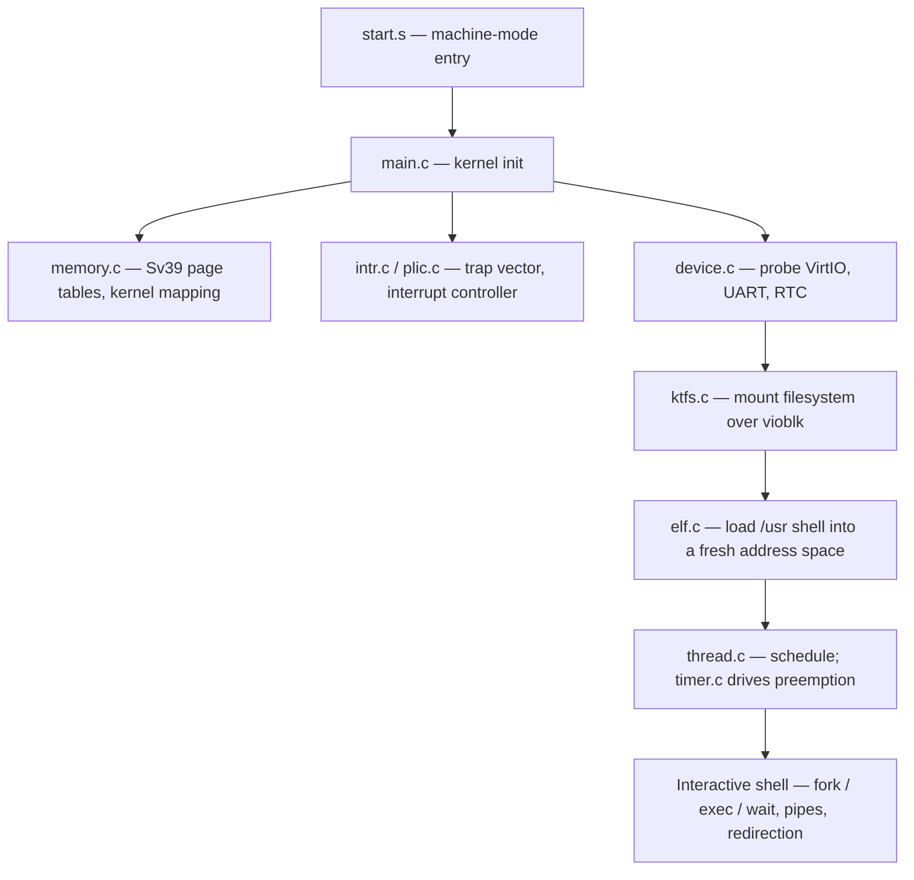

# Operating Systems Kernel

A Unix-like operating system kernel written from scratch in **C** and **RISC-V assembly**,
targeting RV64 under QEMU. It boots to an interactive shell running user binaries in
isolated virtual address spaces, with preemptive multitasking, a custom filesystem, and
VirtIO device drivers.

Built for the Operating Systems course at the University of Illinois Urbana-Champaign.

## Subsystems

| Area | Implementation |
|---|---|
| **Memory** | Sv39 three-level page tables, per-process address spaces, kernel/user separation (`memory.c`, `riscv.h`) |
| **Scheduling** | Preemptive multitasking with timer-driven context switching (`thread.c`, `thrasm.s`, `timer.c`, `process.c`) |
| **Traps** | Exception and interrupt handling, PLIC-backed external interrupts (`excp.c`, `intr.c`, `plic.c`, `trap.s`) |
| **Filesystem** | KTFS, a custom on-disk filesystem, with a write-back block cache (`ktfs.c`, `filesys.c`, `cache.c`) |
| **Syscalls** | User/kernel boundary including `fork`, `exec`, `wait`, and I/O (`syscall.c`, `scnum.h`, `usr/syscall.S`) |
| **Devices** | VirtIO block and RNG, UART console, RTC, ramdisk, behind a common device abstraction (`dev/`, `device.c`) |
| **Loader** | ELF loader that maps user binaries into fresh address spaces (`elf.c`) |
| **Userspace** | Shell with I/O redirection, piping, and background jobs, plus user programs (`usr/`) |

`util/` contains `mkfs_ktfs` and `unmkfs_ktfs` for building and inspecting KTFS images
from the host.

## Boot path



## Layout

```
sys/     kernel — memory, scheduling, traps, filesystem, syscalls, drivers
usr/     userspace — shell, user programs, syscall stubs, libc-style helpers
util/    host tools for creating and unpacking KTFS filesystem images
```

## Building and running

Requires a RISC-V cross toolchain (`riscv64-unknown-elf-gcc`) and `qemu-system-riscv64`.

```bash
cd sys
make
make run
```

This builds the kernel, assembles a KTFS image from `usr/`, and boots it under QEMU with
the console attached to UART.

## Notes

This was a course project; where the course supplied skeleton or support code, the
implementation work sits in the subsystems listed above. It targets RV64 under QEMU and
is not intended to run on physical hardware.
